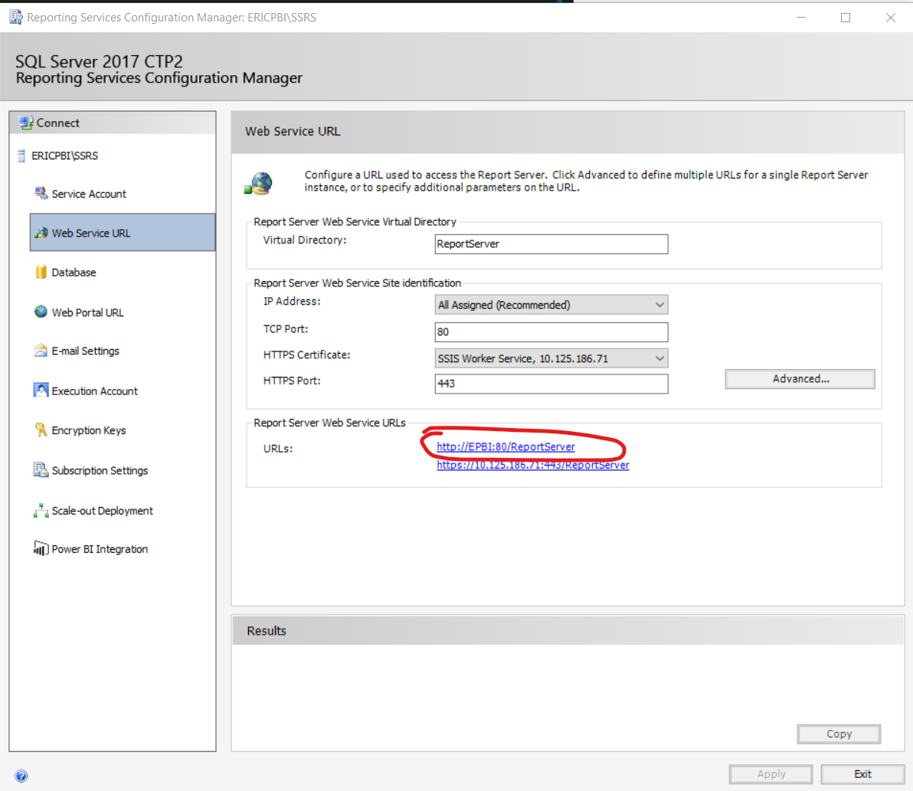

# Using the RDL Migration tool
This tool is designed to help customers migrate SQL Server Reporting Services reports (RDL) from your local server(s) to a Power BI workspace in your tenant.  As part of the migration process, the tool also:

- Converts any shared datasources and/or shared datasets in these report files to be embedded in the report and saves the files locally to disk.

- Checks for unsupported datasources or report components when uploading to Power BI.

- Saves the converted files that pass these checks to a specified Power BI workspace.

- Provides a summary of the successful and unsuccessful assets migrated.

>[!NOTE]
> This process doesn't remove any of the assets from the source.

## Installation

RdlMigration is shipped as part of Power BI Report Builder, which can be downloaded from [Microsoft Download Center](https://www.microsoft.com/download/details.aspx?id=105942)

## Usage

```
# RdlMigration <your Base url endpoint> <file Path> <WorkspaceName>
```

This command saves all the converted files to local disk and displays the status of each file in the command window, as well as a file called ConversionLog.txt.

### Examples

The examples below assume that you are running in a command prompt where the application RdlMigration.exe was copied to. You can get the application by cloning and building this repository, or by downloading the latest build from the 'Releases' tab. See details below on how to find your reportserver endpoint and how to create a Power BI client-id.

- Upload  all reports from 'My reports' folder from a native mode installation of SQL Server Reporting Services or Power BI Report Server to 'My Workspace' in powerbi.com.
    
 ```
 RdlMigration https://ssrsservername/reportserver "/My Reports" "My Workspace"
 ```
    
- Upload  all reports from '/Sales' folder from a native mode installation of SQL Server Reporting Services or Power BI Report Server to 'Sales' workspace in powerbi.com.
    
 ```
 RdlMigration https://ssrsservername/reportserver "/Sales" "Sales"
 ```

- Upload all reports from '/Shared Documents/Reports' folder from a SharePoint integrated mode installation of SQL Server Reporting Services to 'Reports' workspace in powerbi.com.
    
```
RdlMigration "https://sharepointservername/_vti_bin/reportserver" "https://sharepointservername/Shared Documents/Reports" "Reports"
```

- Upload a single report called MonthlySales from '/Shared Documents/SalesReports' folder from a SharePoint integrated mode installation of SQL Server Reporting Services to 'Reports' workspace in powerbi.com.
    
```
RdlMigration "https://sharepointservername/_vti_bin/reportserver" "https://sharepointservername/Shared Documents/SalesReports/MonthlySales.rdl" "Reports"
```
---
## Input details

### Base URL endpoint

This is set in the Reporting Services Configuration Manager under Web Service URL-> Report Server Web Service URL.



### File path

This refers to the relative path to your file or folder on the report server. If the path references a file, the tool converts and pushes only that individual file. If the path references a folder, the tool converts and tries to push all the report files within that folder. This would include any reports contained in the folder and would convert dependencies that might be located in other folders or subfolders (such as Shared DataSources and Shared DataSets). Reports in subfolders aren't published.

### Workspace name

This is the name of the workspace you want to upload your files to. Surround the name with quotation marks if there’s  a space in the name. For example:
```
"Paginated Workspace"
```
